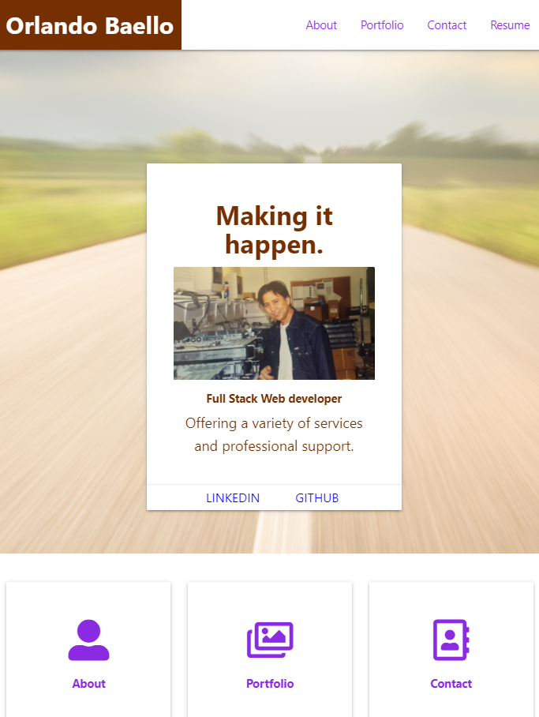

# Updated Portfolio Page
Changing style and layout 

Orlando Baello - Portfolio of Web Development Projects

* ['Portfolio GitHub IO'](https://baello2020.github.io/Updated_Portfolio_Page/)
* ['Portfolio GitHub'](https://github.com/baello2020/Updated_Portfolio_Page)

### Summary
* HTML, CSS, and JS documents create an easy to navigate professional portfolio. 
* This project uses materialize for formatting, styling and mobile compatability

### This project has the following features: 
* Parallax scrolling effect on pages
* Interactive Portfolio page with access to the deployed projects.
    
### This project features responsive design using a Bootstrap layout
### Has responsive layout for: 
** Small devices (landscape phones, 576px and up)
** Medium devices (tablets, 768px and up)
** Large devices (desktops, 992px and up)
** Extra large devices (large desktops, 1200px and up)

### To Execute File:
> Open in browser

### Features: 
* Five HTML Pages
    * Index.html 
        * Contains About Me section with Navigation
    * About.html
        * Provides summary of background and experience 
    * Portfolio Page
        * Contains examples of previous projects
    * Contact Page
        * Contains contact information
    * resume page
        * Provides resume in web format and in a printable pdf format
* CSS Pages Contains styling and layout for all html pages
    
         

